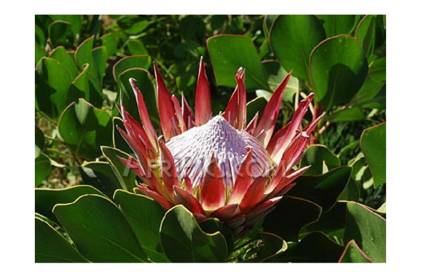
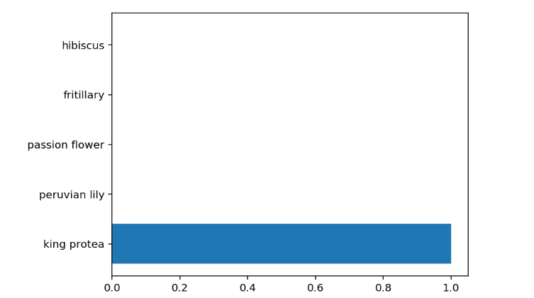

#  own Image Classifier

## 📌 Overview
This project is a deep learning-based image classification system built using PyTorch. The model uses pretrained architectures to classify images into multiple categories.

The project includes both training and inference pipelines, along with a command-line application for real-world usage.

---

##  Objective
To build a robust image classification pipeline that can:
- Train a neural network on labeled image datasets
- Use pretrained models for feature extraction
- Provide CLI-based prediction for real-world use

---

##  Approach

### 1. Data Preprocessing
- Images loaded using `torchvision.datasets.ImageFolder`
- Data split into train, validation, and test sets
- Images resized, cropped, and normalized

---

### 2. Data Augmentation
Applied to training data to improve generalization:
- Random rotation
- Random scaling
- Horizontal flipping
- Random cropping

---

### 3. Model Architecture
- Used pretrained CNN (e.g., VGG16 from `torchvision.models`)
- Froze feature extractor layers
- Built custom feedforward classifier on top
- Trained only classifier layers

---

### 4. Training Pipeline
- Forward + backward propagation implemented in PyTorch
- Loss and accuracy tracked for training and validation
- Hyperparameters configurable (learning rate, epochs, hidden units)
- GPU training support enabled

---

### 5. Model Evaluation
- Tested on unseen dataset
- Measured accuracy on test set
- Performed sanity check using matplotlib visualizations

---

### 6. Inference System
Implemented CLI-based prediction system:

- Load trained checkpoint
- Process input image
- Predict top-K classes
- Map class indices to real labels using JSON file

---

##  Tech Stack
- Python
- PyTorch
- Torchvision
- NumPy
- Matplotlib
- PIL
- JSON

---

## Features

✔ Data augmentation using torchvision transforms    
✔ Custom classifier head  
✔ GPU training support  
✔ Model checkpoint saving & loading  
✔ CLI-based prediction tool  
✔ Top-K probability prediction  
✔ Class name mapping using JSON  
✔ Sanity check visualization  

---
## Flower image classification output:




## Project Structure

```
imageclassification/
│
├── train.py
├── predict.py
├── Image Classifier Project.ipynb
├── cat_to_name.json
└── README.md
```

## 🚀 How to Train

Train a new model using transfer learning:

```bash
python train.py --data_dir ./data --arch vgg16 --epochs 5 --gpu
```

---


##  How to Predict

```bash
python predict.py ./test_image.jpg checkpoint.pth --top_k 5 --category_names cat_to_name.json --gpu
```

---

##  Key Learnings
- Deep learning training pipeline in PyTorch
- Image preprocessing and augmentation techniques
- Model evaluation and debugging
- Building CLI-based ML applications

---

